# Introduction

## **What is a GIS?**

A **GIS** (*Geographic Information System*) is a computerised information system that allows the **acquisition**, **storage**, **analysis**, **visualization** and **exchange** of geographical information in the form of **geo-referenced data**.

It then allows data to be associated with their geographical position on the earth's surface and processed in order to extract information.

The most common **GIS software** are:

* ArcGIS
* QGIS
* GeoMedia
* SagaGIS
...

**Why QGIS?**

It is:

* Free and Open Source
* Constantly updated -> Every 4 months a new version is released

But it has the great advantage for those working with older versions that it can also handle projects made with newer versions.

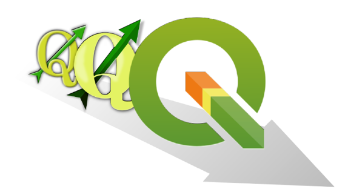

## **Main functionalities**

* **Data visualisation**:

Vector and raster data can be displayed and superimposed in different formats and map projections.

* **Data exploration and map print layout creation**:

You can compose maps and interactively explore spatial data through an easy-to-use graphical interface.

* **Creation, editing, management, export**:

Spatial analysis of data can be performed 

* **Link to external DBs**:

You can view and query data stored on external DBs (e.g., MySQL, PostgreSQL...).

* **Publication of maps on the web**

With native and non-native plugins, QGIS allows you to define settings to make an interactive map to share on web pages.

...and much more!

## Graphic User Interface

The GUI of QGIS Desktop is mainly composed of:

1. **Menu toolbar** where you can find the main QGIS project features grouped by themes.
2. **Attributes and Vector toolbar** customizable that includes shortcuts to the most commonly used tools for data manipulation in a GIS environment.
3. **Loaded layers list** which indicates what data have been included in the project, specifying their characteristics, symbology and visibility.
4. **Map view** that is the map canvas on which the geographic and geometric component of the data can be evaluated graphically.
5. **Status bar** indicating the status of any processings initiated and any errors encountered.

## Data management

**How QGIS handles geographic data?**

What is needed in order to work with QGIS?

* Knowing how to handle geographical data in **different geographical and/or projected coordinate systems**;
* Knowing how to manage a project;
* Knowing how to import:
    * **Vector** data (e.g. shapefile .shp, GeoJSON .geojson...)
    * **Raster** data (e.g. .tiff)
* Understanding the functionalities of **plugin**

**What is the purpose of a reference system?**

**Reference System** -> set of rules that allow us to determine the position in space in a unique way.

This geometric concept is even more important in cartography to correctly locate a point in the territory.

## Geographical reference system

The concept of geographical reference system is the best known and most comprehensive, and perhaps also one of the most powerful georeferencing systems.

**It is metric, standard, stable, unique.**

It uses a well-defined and fixed reference
based on:

* Earth's axis of rotation
* centre of mass
* Greenwich reference meridian
* Equator

[INSERIRE IMMAGINE]

Normally, different R.S. are used for planimetry and altimetry....

* **planimetry**: ellipsoid reference (spherical for small or large scales). Why it is not used for altimetry? No link with the gravity field.

* **altimetry**: geoid reference (no simple analytical description). Why is it not used for planimetry? It is very complex to use in the treatment of observations made for planimetry (due to angles and distances conversion).

## Datum

A **datum (geodetic)**, is a geodetic reference system that allows the position of points on the Earth's surface to be defined in mathematical terms.

**Datum** -> Set of parameters defining the **shape** of the ellipsoid used and its **orientation**.

A datum is composed by 8 parameters:

* 2 for the ellipsoid shape;
* 6 for the position and the orientation:
    * latitude e longitude on the ellipsoid (2)
    * geoid height
    * 2 components of the deviation from the vertical
    * azimut of the ellipsoid

## Projections

The surface of the earth is curved but there are many reasons for representing it on a **plane**, even in numerical cartography.

* The map used to represent the results of GIS analysis is flat.
* Flat maps are scanned and used to create GIS data.
* The raster model is flat (2D)
* It is not possible to see all the land on a curved surface at once
* It is much easier to make measurements in the plane (areas, distances, directions)

For this reason, different **map projections** are also used in numerical cartography.

Cartographic projections carry coordinates from the ellipsoid of the reference system to the map plane. **The two surfaces are not topologically equivalent, so it is not possible to move from ellipsoid to map without deformation.**

Depending on the **geometric shape** adopted, the projections are classified as:

* Planar projections;
* Cylindrical projections;
* Conic projections.

There are many types of map projections, those used in **Italy** are:

* **UTM** (Universal Trasversal Mercator), globally adopted;
* **Gauss-Boaga**, used for the Roma 40 Monte Mario datum;
* **Cassini-Soldner**, used for Nuovo Catasto dei Terreni Italiano.

Ultimately, the definition of a reference system is given by:

* *geographical coordinate systems*:

**Datum** (es. WGS84 or Roma 40 Monte Mario)

* *sistemi di coordinate proiettate*:

**Datum + projection system** (es. WGS84-UTM32N or Roma 40 Monte Mario - Gauss Boaga Fuso Ovest)

In addition, all GIS softwares use geometric parameter registers, the best known of which are the **EPSG** (European Petroleum Survey Group) codes that unambiguously define the various world reference systems.

**How does QGIS handle geographical data?**

The management of **reference systems** is always a particularly delicate element in a GIS.

In QGIS, there are 2 different reference system managements: 

* **Project R.S.**
* **Single layer R.S.**

QGIS is capable of reprojecting on the fly individual layers using the [proj4](https://proj.org/) libraries, provided that the R.S. of the individual layer is defined.

QGIS uses **EPSG** (European Petroleum Survey Group) codes to uniquely define the different global reference systems.

### RS Settings

In the settings panel (***Settings → Options → CRS tab***) it is possible to define the rules with which the layers RS can be managed.

It allows you to define which SR to adopt when opening a new project or how to manage layers without information on the reference system used.

### Layer RS

The **SR of the individual layer** can be managed by right-clicking on the layer.

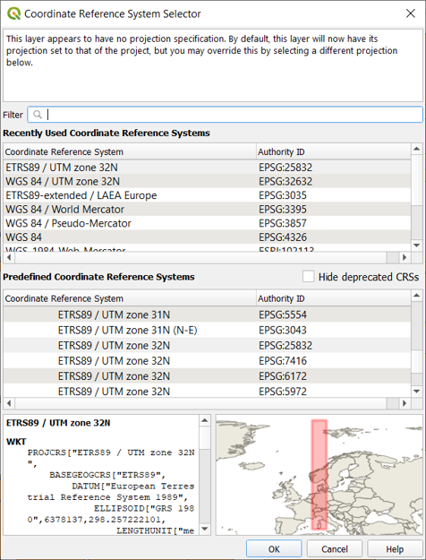

### Reprojection - Shapefile

You can manage the re-projection of vectors: ***Right click on the layer → Save features as…***

## Reality modelling with QGIS

There are mainly two ways of conceptualising or modelling reality from a geographical point of view by considering objects as:

* **Discrete objects**: can be observed or described in the real world and identified by its position

* **Distributed objects**:
represent a quantity whose value is a function of position and can be measured at any location

**Vector** model: information on discrete objects is coded and stored as a set of x, y, z coordinates.

The vector model indicates a representation of geographical entities through:

* **Points**
* **Lines**
* **Polygons**

Vector model features are particularly useful for representing and storing discrete objects such as buildings, roads, particles, etc.

**In the vector model, information on discrete objects is coded and stored as a set of x,y,z coordinates.**

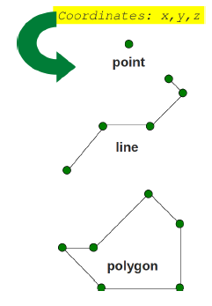

**Raster** model: information on continuous objects, are coded using a set of grid cells, each with its relative value 

Values are cells of a grid with certain extensions and a certain resolution. 

## Vector data

### Shapefile import

### Shapefile properties

To change the properties of the shapefile, right-click on the layer and select properties.

### Style and symbology

**Single symbol display**

It is also possible to set the transparency of the layer, which can be useful if you want to superimpose it on another information layer, e.g. an orthophoto.

In order to better identify the municipalities, it is also possible to insert labels for each geometric unit: click on ***Labels*** → select ***Single Labels*** and choose which **Value** to display.

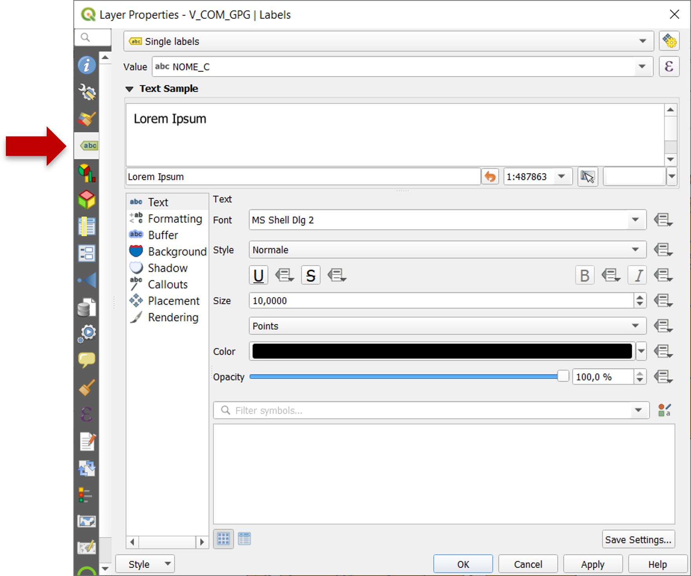

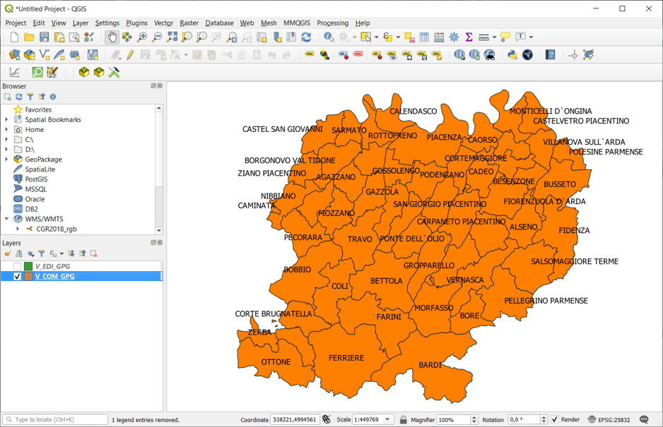

Display with **symbol categorized** according to the values contained in a layer field.

The use of this style also makes it possible to assign to each value a label to be included in the legend. This makes the meaning of the chosen field and its values even clearer and more comprehensible.

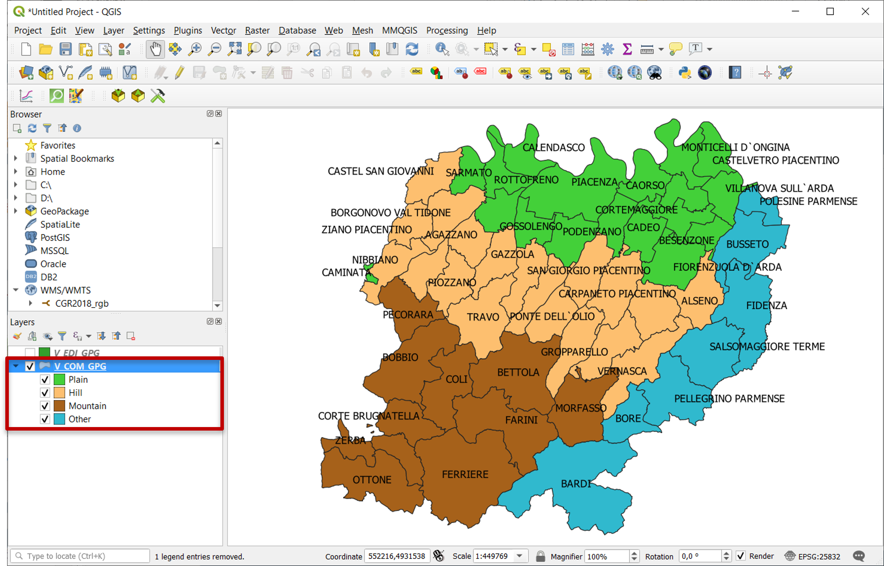

### Attribute table

To delete municipalities that are not part of the province of PC, right-click on the layer in the (Layer panel) → click on ***Open Attribute Table***.

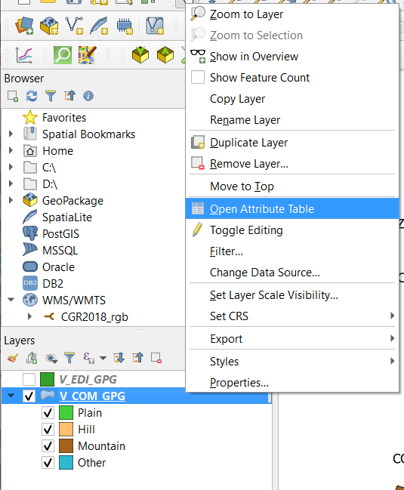

### Editing mode

Click ***Toggle editing mode*** (1) → select the row associated to the municipality to be removed (it will be highlighted in light blue) (2) → click ***Delete selected features*** (3).

The removal of the selected record(s) will be completed only after clicking ***Save edits*** (4) and exiting the editing mode by clicking one more time ***Toggle editing mode*** (5).

Other municipalities outside the province of Piacenza can be removed - with the editing session active - with a query on the column "NM_PRV“ by clicking ***Select features using an expression***.
After formulating the desired expression, you can remove the selected elements and save the operations carried out using the procedure previously described.

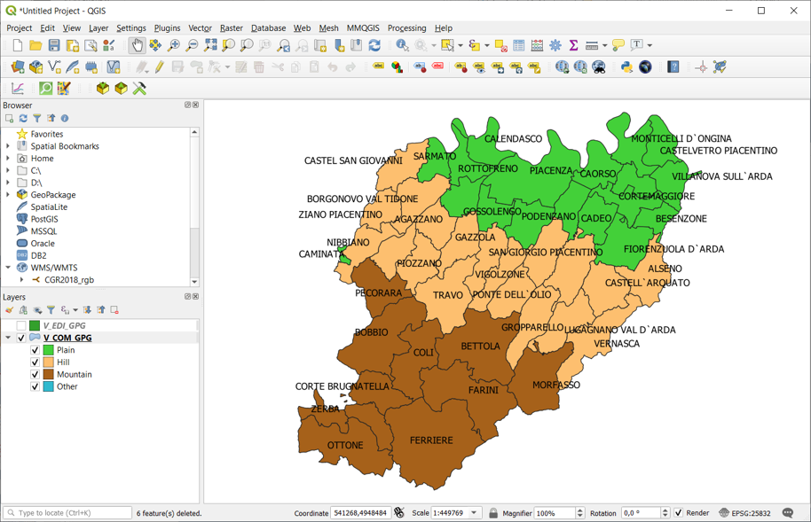

### Adding a new field

***Right click on the layer→ Open Attribute Table→ Toggle editing mode→ New field***

Define the required fields, paying particular attention to the **type of value** that will be entered in the new field (integer, decimal, text, date, etc.) and the **maximum number** of characters.

To finalise the changes introduced on the attribute table, save and end the editing session.

### Field calculator

***Right click on the layer→ Open Attribute Table→ Toggle editing mode→ Open field calculator***

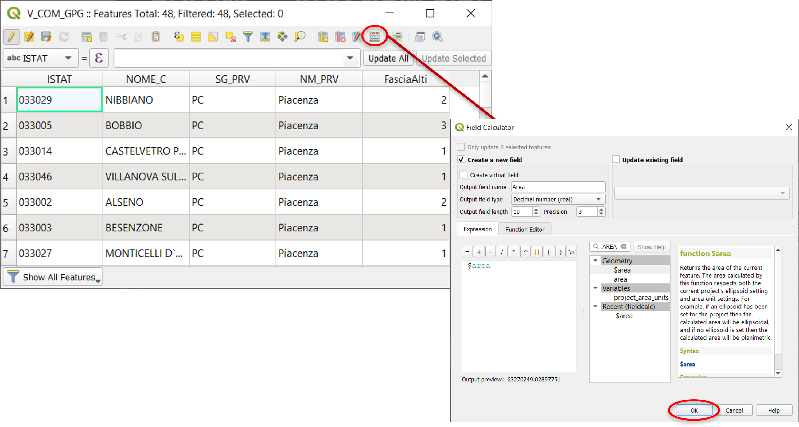

Using the **field calculator** it is possible to create a new field containing the result of a pre-defined function or update with the results an existing field.

The unit of measurement of the result is defined by the reference system of the layer (in this case meters).

To finalize changes, save and end the editing session.

### Delete field

***Right click on the layer→ Open Attribute Table→ Toggle editing mode→ Delete field***

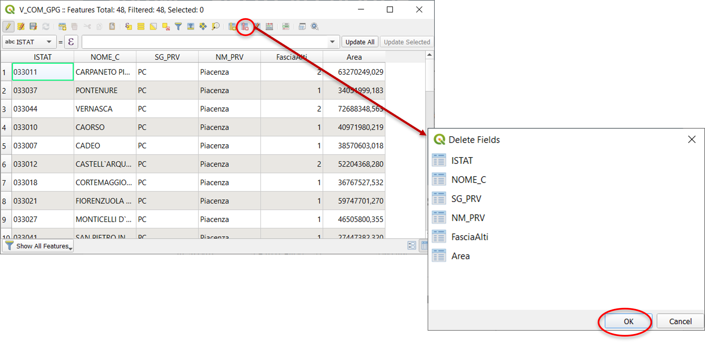

Select the field of interest and confirm the removal.

To finalize changes, save and end the editing session.

### New shapefile - Points

***Layer → Create layer → New shapefile…***

Choose the **type of geometry** (point, line, polygon), define **SR** and **layer name**.
Save (1) and confirm the operation (2).

Toggle editing mode

Select ***Add point feature*** and click on a point in the project map view in order to add an element to the layer.

**Editing options**

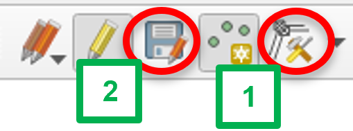

From the toolbar you could either **edit** (1) existing features that are part of the layers or **save** (2) any modification.

## Raster data

What is a **raster**?

**Digital Terrain Models (DTM)** are fundamental data for GIS analysis, but there are also orthophotos, technical maps, aerial photos, satellite images, geological maps, etc.

### Examples

* **DEM** (Digital Elevation Model) is a digital file with ground surface elevation values at regularly spaced intervals in the horizontal plane.

* **DTM** (Digital Terrain Model) has a more generic meaning by indicating not only the height of the ground surface but also other information such as slope and exposure.

* **DSM** (Digital Surface Model) represents in digital form the heights of the upper part of the terrain including buildings, infrastructures and trees without the filtering procedures used to produce DEMs and/or DTMs.

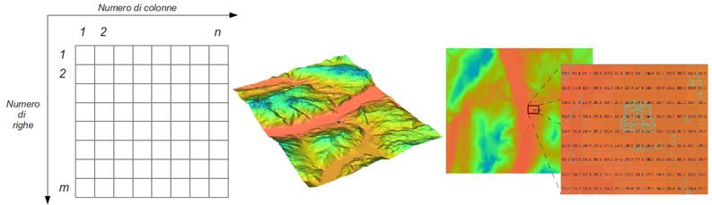

* **Ortophoto**: It is a photographic map that combines the characteristics of a traditional map with those of an image. It is georeferenced, distortion-free and has a uniform scale.

### Raster import

### Reprojection

Raster reprojection using the GDAL libraries:
***Raster → Projections → Warp (Reproject)…***

### Properties

To change the properties of the raster, right-click on the layer of interest and select **Properties**:

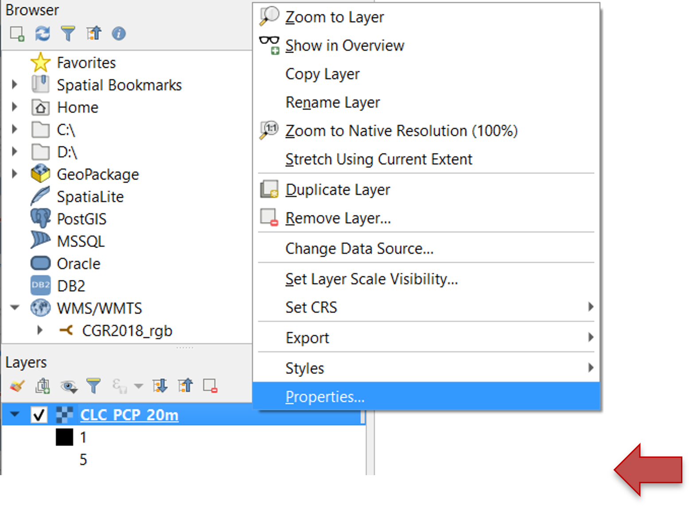

### Style

Change the **style**:

* Singleband grey
* Multiband color
* Paletted/Unique values
* Singleband pseudo-color
* Hillshade

…and other statistical settings

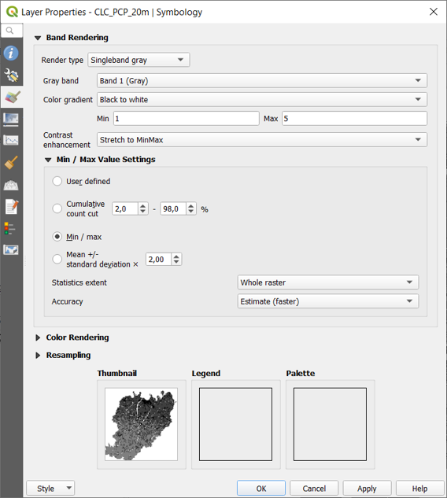

**Example**

*Corine Land Cover (CLC)*

Map of land cover classified according to 5 classes of first reference level:

1. Artificial surfaces
2. Agricultural areas
3. Forest and seminatural areas
4. Wetlands
5. Water bodies

... it's a matter of classification by value classes!

### Paletted/Unique values style

Set the **Paletted/Unique values** render type and define the **visualisation style** (color and label) for each first level land cover class.

### Transparency

Manage the **layer transparency**:

* Global opacity
* Customized for selected classes

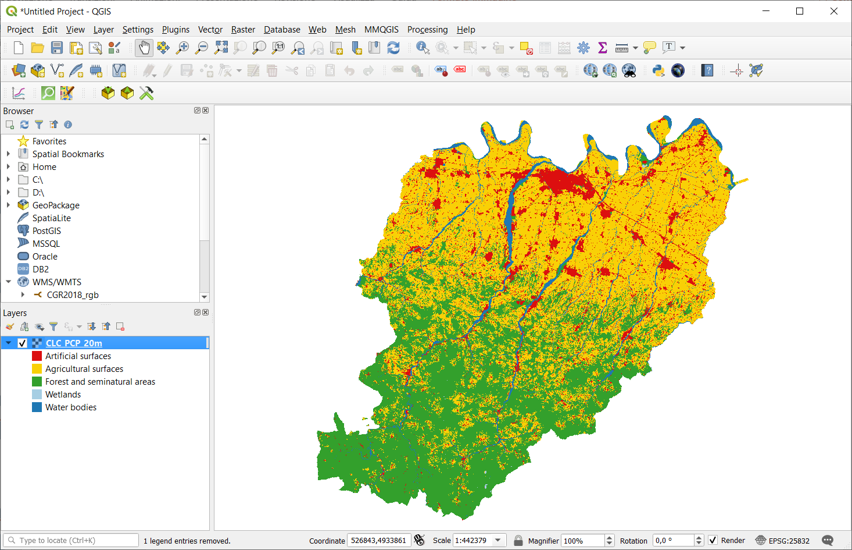

## Save a project

Saving the project **(*.qgs)** concerns the following elements:

* List of recalled maps (layers);
* Display modes (colors, styles, transparencies,...);
* Printing layouts;
* RS used and last display extension.

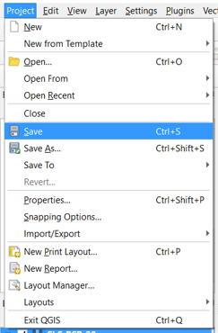

The *.qgs file does not contain map files but only references to them and is saved in XML format.

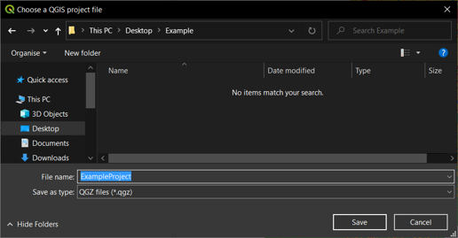