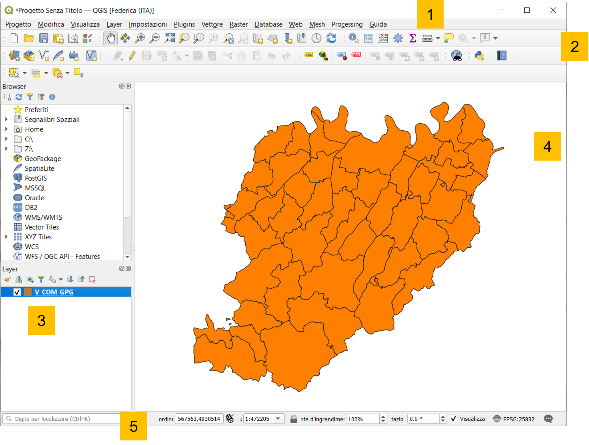
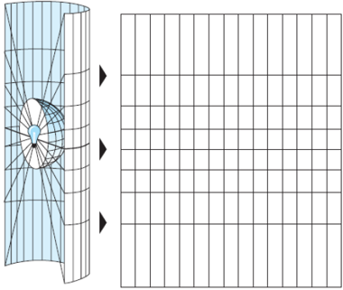

# Introduzione

## **Che cos'è un GIS?**

Un **GIS** (*Geographic Information System*) è un sistema informativo computerizzato che permette di **acquisire**, **registrare**, **analizzare**, **visualizzare**, **restituire**, **condividere** e **presentare** informazioni da **dati geografici** (*georiferiti*).

Permette quindi di associare i dati alla loro posizione geografica sulla superficie terrestre e di elaborarli per estrarne informazioni.

I principali **software GIS** disponibili sono:

* ArcGIS
* QGIS
* GeoMedia
* SagaGIS
...

**Perché QGIS?**

E' un software:

* Free and Open Source
* In forte evoluzione -> Ogni 4 mesi viene rilasciata una nuova release

Inoltre, QGIS ha il grande vantaggio per chi lavora con versioni più datate di poter gestire anche progetti realizzati con versioni più recenti.

## **Le funzionalità principali**

* **Visualizzazione dei dati**:

si possono visualizzare e sovrappore dati vettoriali e raster in diversi formati e proiezioni cartografiche.

* **Esplorazione di dati e creazione di mappe**:

si possono comporre mappe ed esplorare interattivamente dati spaziali tramite una facile interfaccia grafica.

* **Creazione, editing, gestione, esportazione**:

possono essere eseguite analisi spaziali di dati.

* **Collegamento a DB esterni**

è possibile visualizzare e interrogare dati memorizzati su DB (es. MySQL, PostgreSQL...) esterni.

* **Pubblicazione di mappe sul web**

con plugin nativi e non, QGIS permette di definire le impostazioni per realizzare una mappa interattiva da condividere su pagine web.

...e molto altro!

## Graphic User Interface

La GUI di QGIS Desktop è principalmente composta da:

1. **Barra dei menù** dove è possibile trovare le principali funzionalità di progetto QGIS raggruppate per tematiche.
2. **Barra delle applicazioni** personalizzabile che include le scorciatoie ai tool di più comune utilizzo per la manipolazione dei dati in ambiente GIS.
3. **Elenco dei layers caricati** che indica quali dati sono stati inseriti nel progetto, specificandone le caratteristiche, la simbologia e la visibilità.
4. **Area di visualizzazione layers** ovvero la map canvas su cui è possibile valutare graficamente la componente geografica e geometrica dei dati.
5. **Barra di stato** che indica lo stato di avanzamento di eventuali processamenti avviati ed eventuali errori riscontrati.

## Gestione dati

**Come vengono gestiti i dati geografici in QGIS?**

Cosa serve per lavorare in QGIS?

* Saper gestire dati geografici nei **diversi sistemi di coordinate** geografiche e/o proiettate;
* Saper gestire un **progetto**;
* Saper importare:
    * Dati **vettoriali** (e.g. shapefile .shp, GeoJSON .geojson...)
    * Dati **raster** (e.g. .tiff)
* Comprendere la logica dei **plugins**

**A cosa serve un sistema di riferimento?**

**Sistema di riferimento** -> insieme di regole che ci consentono di risalire alla posizione nello spazio in maniera univoca.

Questo concetto tipicamente geometrico è ancora più importante in cartografia per localizzare correttamente un punto appartenente al territorio.

## Sistema di riferimento geografico

Sicuramente il sistema di riferimento geografico è il più conosciuto e comprensivo e forse anche uno tra i più potenti sistemi di georeferenziazione.

**Esso è metrico, standard, stabile, unico.**

Utilizza un riferimento ben definito e fisso basato su:

* asse di rotazione terrestre
* centro di massa
* meridiano di riferimento di Greenwich
* equatore

[INSERIRE IMMAGINE]

Normalmente si usano diversi SR per planimetria e altimetria.

* **planimetria**: riferimento ellissoidico (sferico per piccole o grandi scale). Perché non lo uso per l'altimetria? Perché privo di legame con il campo della gravità.

* **altimetria**: riferimento geoidico (non ha descrizione analitica semplice). Perché non lo uso per la planimetria? Di impiego molto complesso nel trattamento delle osservazioni effettuate per la planimetria (angoli e distanze).

## Datum

Un **datum (geodetico)** è un sistema geodetico di riferimento che consente di definire in termini matematici la posizione di punti sulla superficie della Terra.

**Datum** -> Insieme di parametri che definiscono la **forma** dell'ellissoide usato ed il suo **orientamento**.

Un datum è costituito da 8 parametri:

* 2 di forma dell'ellissoide;
* 6 di posizione e di orientamento:
    * latitudine e longitudine ellissoidica (2)
    * altezza geoidica
    * 2 componenti della deviazione della verticale
    * azimut ellissoidico

## Proiezioni

La superficie della terra è curva ma ci sono molte ragioni che ci spingono a rappresentarla su **piano**, anch in cartografia numerica.

* La carta utilizzata per rappresentare i risultati di analisi fatte con GIS è piatta.
* Le carte piatte sono scansionate ed utilizzate per creare dati GIS.
* Il modello raster è piatto
* Non si può vedere contemporaneamente tutta la terra su una superficie curva
* E' molto più facile effettuare misure nel piano (aree, distanze, direzioni).

Per queste ragioni anche in cartografia numerica si utilizzano le diverse **proiezioni cartografiche**.

Le proiezioni cartografiche trasportano coordinate dall'ellissoide del sistema di riferimento al piano della carta. **Le due superfici non sono topologicamente equivalenti, quindi non è possibile passare da ellissoide a carta senza deformazioni.**

A seconda del **tipo di forma** usato per effettuare le proiezioni, si distinguono:

* proiezioni piane;
* proiezioni cilindriche;
* proiezioni coniche.

Ci sono moltissimi tipi di proiezioni cartografiche, quelle utilizzate in **Italia** sono:

* **UTM** (Universal Trasversal Mercator), utilizzata a livello mondiale;
* **Gauss-Boaga**, utilizzata per il datum Roma 40 Monte Mario;
* **Cassini-Soldner**, utilizzata dal Nuovo Catasto dei Terreni Italiano.

In definitiva, la definizione di un sistema di riferimento è data da:

* *sistemi di coordinate geografiche*:

**Datum** (es. WGS84 oppure Roma 40 Monte Mario)

* *sistemi di coordinate proiettate*:

**Datum + sistema di proiezione** (es. WGS84-UTM32N oppure Roma 40 Monte Mario - Gauss Boaga Fuso Ovest)

Inoltre tutti i GIS utilizzano i registri di parametri geometrici di cui il più conosciuto è quello rappresentato dai **codici EPSG** (European Petroleum Survey Group) per definire in maniera univoca i vari sistemi di riferimento mondiali.

**Come gestisce QGIS i dati geografici?**

La gestione dei **sistemi di riferimento** è sempre un elemento particolarmente delicato in un GIS.

In QGIS esistono 2 diverse gestioni di sistemi di riferimento:

* S.R. del **progetto**
* S.R. del **singolo layer**

QGIS è in grado di eseguire la riproiezione al volo dei singoli layer tramite le librerie [proj4](https://proj.org/), purché sia definito il S.R. del singolo layer.

QGIS usa i codici **EPSG** (European Petroleum Survey Group) per definire in maniera univoca i vari sistemi di riferimento mondiali.

### Impostazioni SR

Dalle impostazioni (***Impostazioni -> Opzioni -> SR tab***) è possibile definire le regole con cui gestire i SR dei vari layer.

Permette di definire quale SR adottare al momento dell'apertura di un nuovo progetto o come gestire i layers privi di informazioni circa il sistema di riferimento utilizzato.

[INSERIRE IMMAGINE]

### SR del layer

Il **SR del singolo layer** è gestibile cliccando con il tasto destro del mouse sul layer stesso.

[INSERIRE IMMAGINE]

[INSERIRE IMMAGINE]

### Riproiezione - Shapefile

E' possibile gestire la ri-proiezione dei vettori: ***tasto destro sul layer -> Salva con nome...***

[INSERIRE IMMAGINE]

## Modellazione della realtà con QGIS

Esistono principalmente due modi di concettualizzare o modellare la realtà da un punto di vista geografico considerando:

* **Oggetti discreti**: possono essere osservati o descritti nel mondo reale ed identificati da una sua posizione.

* **Oggetti distribuiti**:
rappresentano una grandezza il cui valore è funzione della posizione e si può misurare in ogni luogo.

Il modello **vettore** in cui le informazioni su oggetti discreti sono codificate ed archiviate come insieme di coordinate x, y, z.

Il modello vettoriale indica una rappresentazione di entità geografiche attraverso:

* **Punti**
* **Linee**
* **Poligoni**

I modelli vettoriali sono particolarmente utili per rappresentare e memorizzare oggetti discreti come edifici, strade, particelle, etc.

**Nel modello vettoriale le informazioni su oggetti discreti sono codificate e archiviate come insieme di coordinate x, y, z.**

Il modello **raster** in cui informazioni su oggetti continui sono codificate da un insieme di celle di una griglia, ciascuna con il suo valore relativo.

I valori sono celle di una griglia con determinate estensioni e una determinata risoluzione.

## Importazione shapefile

## Gestione proprietà shapefile

Per modificare le proprietà dello shapefile, cliccare sul layer con il tasto destro e selezionare proprietà.

[INSERIRE IMMAGINE]

### Stile

**Visualizzazione con singolo simbolo**

[INSERIRE IMMAGINE]

E' possibile anche impostare la trasparenza del layer che può essere utile nei casi in cui si vuole sovrappore questo ad un altro strato informativo (es. un'ortofoto).

**Visualizzazione con simbolo categorizzato** in base ai valori contenuti in un campo del layer.

[INSERIRE IMMAGINE]

L'utilizzo di questo stile permette anche di assegnare a ogni valore individuato un'etichetta da includere nella legenda. In questo modo il significato del campo scelto e dei suoi valori risulta ancora più chiaro e comprensibile.

[INSERIRE IMMAGINE]

### Etichette

Per identificare meglio i comuni è possibile inserire anche le etichette relative ad ogni unità geometrica: cliccare su **etichette** -> Selezionare ***Etichette singole*** e scegliere quale ***Valore*** far comparire.

[INSERIRE IMMAGINE]

[INSERIRE IMMAGINE]

## Dati vettoriali

### Tabella attributi

Per visualizzare la tabella con i comuni della provincia di PC, cliccare con il tasto destro sul layer nel pannello layer -> premere ***Apri tabella attributi***

### Aggiunta campo

***Tasto destro sul layer -> Apri tabella attributi -> Attiva modifiche -> Nuovo campo***

[INSERIRE IMMAGINE]

Definire i campi richiesti con particolare attenzione al **tipo di valore** che verrà inserito nel nuovo campo (numero intero, decimale, testo, data, etc.) e il **numero massimo di caratteri**.

[INSERIRE IMMAGINE]

Per finalizzare le modifiche, salvare e concludere la sessione di editing.

### Calcolatore di campi

***Tasto destro sul layer -> Apri tabella attributi -> Attiva modifiche -> Apri il calcolatore di campi***

[INSERIRE IMMAGINE]

Con il **calcolatore di campi** è possibile creare un nuovo campo con il risultato della funzione scelta oppure aggiornarne uno esistente.

[INSERIRE IMMAGINE]

### Rimuovi campo

***Tasto destro sul layer -> Apri tabella attributi -> Attiva modifiche -> Elimina campo***

[INSERIRE IMMAGINE]

Selezionare il campo di interesse e confermare la rimozione.

[INSERIRE IMMAGINE]

Per finalizzare le modifiche, salvare e concludere la sessione di editing.

## Dati raster

Che cos'è un raster?

[INSERIRE IMMAGINE]

Un dato fondamentale per le analisi GIS sono i cosiddetti **Digital Terrain Model** (DTM) ma ci sono anche **Ortofoto**, **Carte tecniche**, foto aree, immagini satellitari, mappe geologiche etc.

### Modelli digitali delle altezze

* **DEM** (Digital Elevation Model) è un file digitale con le quote della superficie del terreno a intervalli regolarmente spaziati sul piano orizzontale.

* **DTM** (Digital Terrain Model) avrebbe un significato più generico indicando oltre alla quota della superficie del terreno anche altre informazioni come pendenza ed esposizione.

* **DSM** (Digital Surface Model) rappresenta in forma digitale le quote della parte superiore del terreno comprensivo degli edifici, delle infrastrutture e degli alberi senza le procedure di filtraggio utilizzare per produrre DEM e/o DTM.

[INSERIRE IMMAGINE]

### Ortofoto

E' una mappa fotografica che combina le caratteristiche di una mappa tradizionale con quelle di un'immagine. E' georeferenziata, priva di distorsioni e con scala uniforme.

### Importare un raster

[INSERIRE IMMAGINE]

### Riproiezione

La riproiezione raster tramite le librerie GDAL:
***Raster -> Proiezioni -> Riproiezione**

[INSERIRE IMMAGINI]

### Proprietà

Per modificare le proprietà del raster, cliccare sul tasto destro e selezionare **proprietà**:

[INSERIRE IMMAGINE]

### Stile

Modificare lo **stile**:

* Banda singola grigia
* Colori banda multipla
* Valori a tavolozza
* Banda singola falso colore
* Omreggiatura

...e altre opzioni statistiche.

[INSERIRE IMMAGINE]

[IN COSTRUZIONE//]