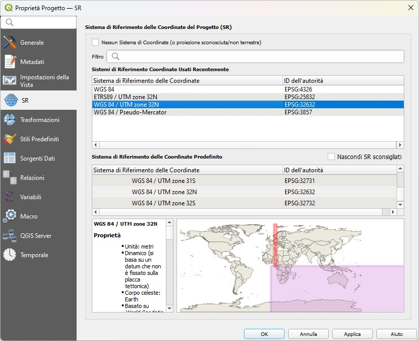
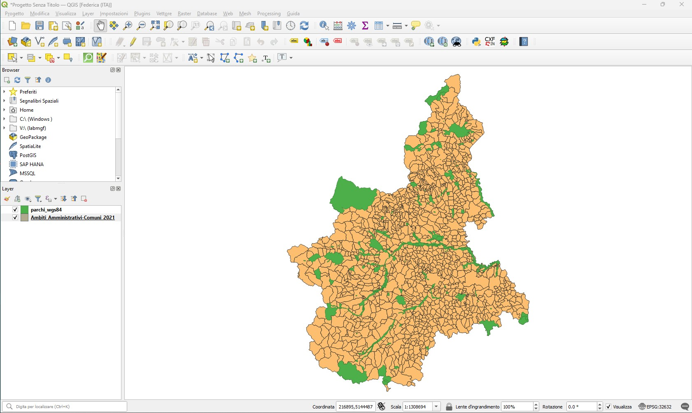

# Workshop introduttivo

**Benvenuti nel mondo del Software Open Source per applicazioni geospaziali!**

In questo workshop introduttivo scoprirete cosa si intende con **[FOSS4G](#foss4g)**, cos'è e di cosa si occupa **[OSGEO](#osgeo)** e avrai un piccolo assaggio delle potenzialità di **[QGIS](#qgis)**.

## FOSS4G

Di cosa si parla quando si utilizza l'acronimo **FOSS4G**?

Dal 2004, anno in cui questo termine fa il suo debutto ufficiale su una pubblicazione scientifica, con questa sigla si fa riferimento all'ambito dei **F**ree and **O**pen **S**ource **S**oftware for **G**eospatial, indicando la grande famiglia di applicazioni libere e open-source sviluppate da una community di appassionati e professionisti nel settore della geoinformatica e delle scienze geografiche.

Dal 2004 l'acronimo è stato ufficialmente adottato come titolo delle conferenze annuali che vengono organizzate in ogni parte del mondo dalla comunità di sviluppatori e utilizzatori dei software. Allo stesso anno di inizio della serie di conferenze corrisponde anche la nascita del logo ufficiale di FOSS4G: un **nastro** che simboleggia lo scorrere libero di idee e ispirazioni nell'ambito dell'open-source. Scorrendo i loghi delle conferenze negli anni, il nastro rimane sempre il filo conduttore di una community in continua evoluzione e crescita.

L'ultimo raduno globale ha avuto luogo a **Firenze** nell'agosto del 2022, esattamente 20 anni dopo il primo raduno informale di appassionati di software libero geoografico avvenuto a Trento nel 2002.

L'evento si articola in una serie di incontri, workshop e presentazioni su più giorni in cui sviluppatori e utilizzatori possono confrontarsi sulle novità dei software, discutendo sui bisogni degli utenti e sulle future prospettive dei progetti. Non si tratta unicamente di una conferenza dedicata quindi esclusivamente a **sviluppatori** ma anche a **utilizzatori**, **ricercatori** in ambito accademico e non ma anche ad **aziende** e **enti pubblici** attive in ambito geospaziale.

Dal 2006, l'organizzazione della conferenza è coordinata a livello globale dall'**Open Geospatial Foundation** (OSGEO) e reso possibile da un comitato organizzativo locale di volontari.

La prossima conferenza FOSS4G avrà luogo a **Prizren in Kosovo** dal 26 giugno al 2 luglio 2023.

Parallelamente, con cadenza annuale o biannuale, vengono organizzate delle conferenze locali, tendenzialmente a livello nazionale, dai local chapter di OSGeo. In Italia la conferenza prende il nome di **FOSS4G-IT**. Nel 2023 avrà luogo a **Bari** dall'11 al 14 giugno nell'ambito dei **GEODaysIT 2023**.

Maggiori info:

- [Sito ufficiale delle conferenze globali](https://foss4g.org/)
- [FOSS4G 2023 Prizren](https://2023.foss4g.org/)
- [Canale YouTube ufficiale](https://www.youtube.com/@FOSS4G)
- [GEODays2023 IT](https://2023.geodaysit.it/)

## OSGEO

La **Open Source Geospatial Foundation** (OSGEO) è l'organizzazione non-profit che dal 2006 coordina l'organizzazione delle conferenze *FOSS4G*. La missione principale di OSGEO è promuovere l'adozione globale della tecnologia geospaziale aperta, essendo una fondazione software inclusiva dedicata a una filosofia aperta e allo sviluppo partecipativo guidato dalla comunità.

La fondazione fornisce sostegno finanziario, organizzativo e legale alla più ampia comunità geospaziale open source. Inoltre, funge da entità legale indipendente a cui i membri della comunità possono contribuire con codice, fondi e altre risorse, sicuri che i loro contributi saranno mantenuti a beneficio del pubblico. OSGeo funge anche da organizzazione di sensibilizzazione e di advocacy per la comunità geospaziale open source e fornisce un forum comune e un'infrastruttura condivisa per migliorare la collaborazione tra progetti.

I progetti della fondazione sono tutti liberamente disponibili e utilizzabili con una licenza open source certificata dalla **[Open Source Initiative](https://opensource.org/licenses/)**. Tra questi figurano librerie di codice, tool per il web mapping, database e software GIS per l'elaborazione e analisi di dati territoriali.

Tra i più noti:

- **[QGIS](https://www.osgeo.org/projects/qgis/)**, il principale GIS desktop gratuito e open source  che permette di creare, modificare, visualizzare, analizzare e pubblicare informazioni geospaziali su Windows, Mac OS, Linux e Android.
- **[PostGIS](https://www.osgeo.org/projects/postgis/)**, un'estensione di database spaziale per il DBMS PostgreSQL che fornisce nuovi tipi di geometria, geografia, raster e topogeometria a PostgreSQL e funzioni conformi a SQL/MM OGC SFSQL per svolgere lavori GIS come la gestione catastale e il back-end per servizi di mappatura Web.
- **[OpenLayers](https://www.osgeo.org/projects/openlayers/)**, libreria open-source JavaScript che permette di inserire facilmente mappe dinamiche in pagine web. 
- ... e molti altri!!

A livello locale/nazionale, esistono numerose sezioni di OSGeo che si occupano del coordinamento dello sviluppo dei progetti in ambito territoriale e dell'organizzazione di eventi e conferenze. In Italia opera dal 2007 l'**Associazione italiana per l'informazione geografica libera** nota anche con l'acronimo **GFOSS.IT**.

Maggiori info:

- [Sito ufficiale](https://www.osgeo.org/)
- [Sito GFOSS.IT](https://www.gfoss.it/)

## QGIS

Cos'è un GIS?

Con la sigla GIS si fa riferimento a un *G*eographic *I*nformation *S*ystem (in italiano anche noto come Sistema Informativo Territoriale o SIT), ovvero un software che permette l'**acquisizione**, **creazione**, **analisi**, **visualizzazione**, **condivisione** e **presentazione** di informazioni geografiche.

**QGIS** - in precedenza noto anche come *QuantumGIS* - è un software GIS free e open-source che rientra tra i progetti supportati da OSGEO.
Sin dalla sua prima versione rilasciata pubblicamente nel 2002, il software ha raccolto un grande entusiasmo nella comunità open-source e non solo, coinvolgendo sempre più sviluppatori e utenti da tutto il mondo.

In occasione di ogni edizione di FOSS4G, gli sviluppatori presentano le nuove funzionalità del software e gli indirizzi di sviluppo per le prossime versioni. Uno dei grandi punti di forza di QGIS è proprio la sua flessibilità in termini di aggiornamento: ogni 4 mesi, infatti, viene rilasciata una nuova **Long Term Release** (più stabile per l'utilizzo frequente) e una versione avanzata con funzionalità avanzate in fase di test, mantenendo però sempre compatibilità per i progetti realizzati con le versioni precedenti. Molto spesso tali funzionalità vengono prima abbozzate e ideate e poi sviluppate durante gli incontri online e in presenza organizzati dalla community (*QGIS Hackfest*, *User conference*, *Contributor Meeting* e *QGIS Open Day*).

Tra le funzionalità principali di QGIS vi sono:

- **Visualizzazione dei dati**

si possono visualizzare e sovrappore dati vettoriali e raster in diversi formati e proiezioni cartografiche.

- **Esplorazione di dati e creazione di mappe**:

si possono comporre mappe ed esplorare interattivamente dati spaziali tramite una facile interfaccia grafica.

- **Creazione, editing, gestione, esportazione**:

possono essere eseguite analisi spaziali di dati.

- **Collegamento a DB esterni**

è possibile visualizzare e interrogare dati memorizzati su DB (es. MySQL, PostgreSQL...) esterni.

- **Pubblicazione di mappe sul web**

con plugin nativi e non, QGIS permette di definire le impostazioni per realizzare una mappa interattiva da condividere su pagine web.

...e molto altro!

Il software può essere scaricato su sistemi operativi Windows, MacOS e Linux seguendo le [istruzioni e la documentazione](https://www.qgis.org/it/site/forusers/download.html) presente sul sito ufficiale.

### Graphic User Interface

La GUI di QGIS Desktop è principalmente composta da:

1. **Barra dei menù** dove è possibile trovare le principali funzionalità di progetto QGIS raggruppate per tematiche.
2. **Barra delle applicazioni** personalizzabile che include le scorciatoie ai tool di più comune utilizzo per la manipolazione dei dati in ambiente GIS. Come ogni software GIS, infatti la gestione di operazioni ed elaborazioni in ambiente QGIS avviene attraverso la creazione di *progetti* in cui sono caricati dall'utente dati georiferiti e non secondo *strati informativi* su più livelli. 
3. **Elenco dei layers caricati** che indica quali dati sono stati inseriti nel progetto, specificandone le caratteristiche, la simbologia e la visibilità. 
4. **Area di visualizzazione layers** ovvero la map canvas su cui è possibile valutare graficamente la componente geografica e geometrica dei dati.
5. **Barra di stato** che indica lo stato di avanzamento di eventuali processamenti avviati ed eventuali errori riscontrati.

### Esercizio

In questo workshop introduttivo di QGIS verranno illustrate alcune operazioni di utilizzo comune in ambiente GIS per realizzare una mappa digitale del territorio di Arona evidenziando la presenza di piste ciclabili, parcheggi per biciclette e aree verdi.

#### Dati

In ambiente GIS esistono principalmente due modi di concettualizzare o modellare la realtà da un punto di vista geografico considerando:

* **Oggetti discreti**: possono essere osservati o descritti nel mondo reale ed identificati da una sua posizione. In questo caso viene adottato il cosiddetto **modello vettoriale** che indica una rappresentazione di entità geografiche attraverso **punti**, **linee**, **poligoni**. Tipicamente vengono utilizzati file in formato *shapefile*, *geojson* o *geopackage*.

* **Oggetti distribuiti**:
rappresentano una grandezza il cui valore è funzione della posizione e si può misurare in ogni luogo. In questo caso, i GIS adottando il modello **raster** in cui informazioni su oggetti continui sono codificate da un insieme di celle (pixel) di una griglia, ciascuna con il suo valore relativo. Il formato più diffuso è il *tif*, usato per ortofoto e modelli digitali del terreno.

Per l'esercizio con QGIS verranno utilizzati dati vettoriali provenienti da diverse fonti:

- [Ambiti Amministrativi - Regione Piemonte](https://www.datigeo-piem-download.it/direct/Geoportale/RegionePiemonte/Limiti_amministrativi/Ambiti_amministrativi_comuni_serie_storica/AMBITI_AMMINISTRATIVI_COMUNI_2021.zip) [FONTE: *Geoportale Piemonte* - Ultimo Accesso: 17/03/2023]
- [Aree Protette Natura 2000 - Regione Piemonte](http://giscartografia.csi.it/Parchi/parchi_wgs84.zip) [FONTE: *Geoportale Piemonte* - Ultimo Accesso: 17/03/2023]
- [Dati OpenStreetMap](https://www.openstreetmap.org/#map=14/45.7500/8.5658)

#### Nuovo progetto

Avviare QGIS Desktop sul proprio pc. Nella schermata di benvenuto cliccare **Nuovo Progetto Vuoto** oppure dalla voce **Progetto** nella barra dei menù, selezionare **Nuovo**.

In questo modo si crea un nuovo progetto QGIS in cui poter lavorare: esso sarà il "contenitore" di tutti i singoli dati geografici che verranno caricati in strati informativi e delle loro elaborazioni ed analisi.

Prima di iniziare a caricare nuovi dati nel progetto, è necessario definire il **sistema di riferimento cartografico** all'interno del quale sono inquadrati i dati vettoriali. Questo passaggio è essenziale per permettere la corretta interpretazione del riferimento geografico contenuto nei dati, definendo il corretto sistema di coordinate e l'unità di misura del progetto. Per l'Italia e Regione Piemonte il sistema di riferimento adottato è il WGS84 - UTM Zone 32 Nord, indicato con codifica standard EPSG: 32632. Tale informazione deve essere indicata anche nel progetto QGIS accedendo al menù delle proprietà da ***Progetto > Proprietà > Tab SR***. Nel box di ricerca digitare 32632 e scegliere la voce corrispondente dalla lista di Sistemi di Riferimento. Una volta selezionata, cliccare *Applica* e poi *Ok* per tornare alla visualizzazione principale del progetto.

Salvare quindi il progetto dal menù ***Progetto > Salva***.

#### Caricamento dati

I dati vettoriali dell'esercizio sono forniti in forniti in formato shapefile. L'estensione di riferimento in questo caso è *.shp* che contiene la geometria del dataset. Tuttavia, per poter leggere correttamente il dato all'interno dell'ambiente GIS, ogni file .shp è sempre accompagnato da almeno altri due file "ombra" con estensione *.shx* (che contiene gli indici spaziali) e *.dbf* (che contiene il database, ovvero la componente tabellare del dataset). Per questo motivo è estremamente importante che dopo aver unzippato le cartelle dati scaricate in precedenza, non si cancellino i dati senza estensione .shp anche se all'apparenza potrebbero risultare inutili.

Il metodo più intuitivo e pratico per il caricamento di nuovi dati vettoriali all'interno del progetto QGIS consiste in un semplice *drag&drop* dalla cartella in cui il file .shp è salvato allo spazio del map canvas in QGIS.
In tale modo si procede quindi con il caricamento dei dati .shp dei confini amministrativi e dei parchi Natura 2000.

[...]