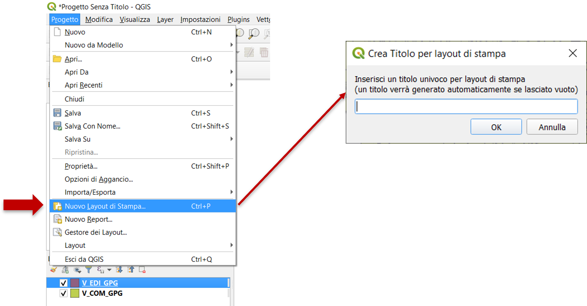
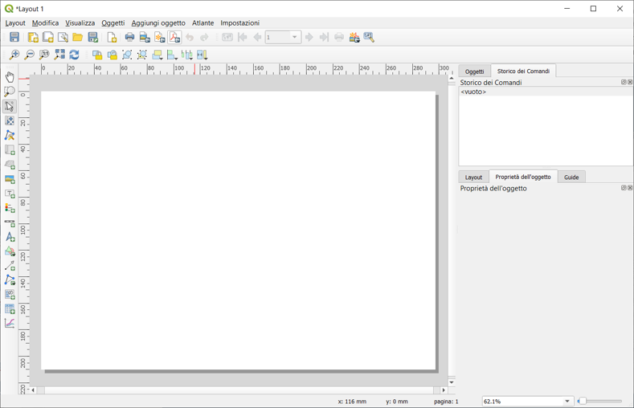
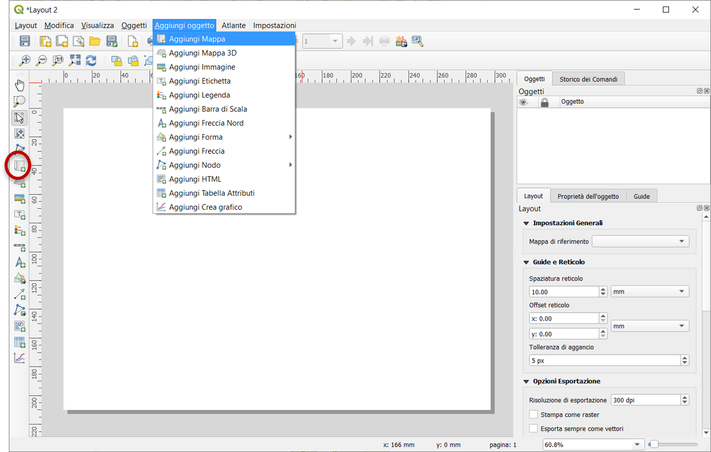
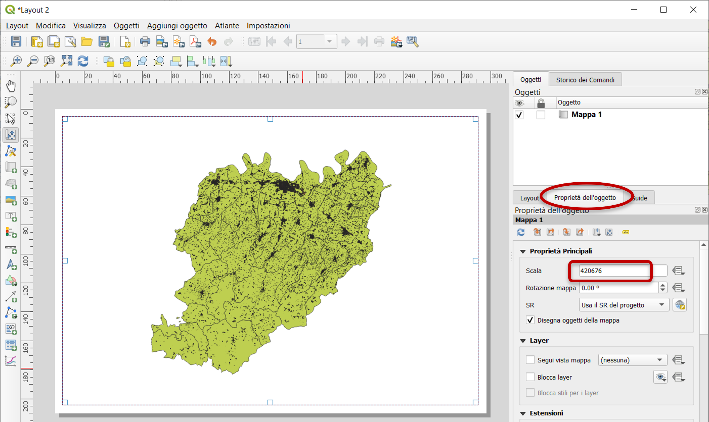
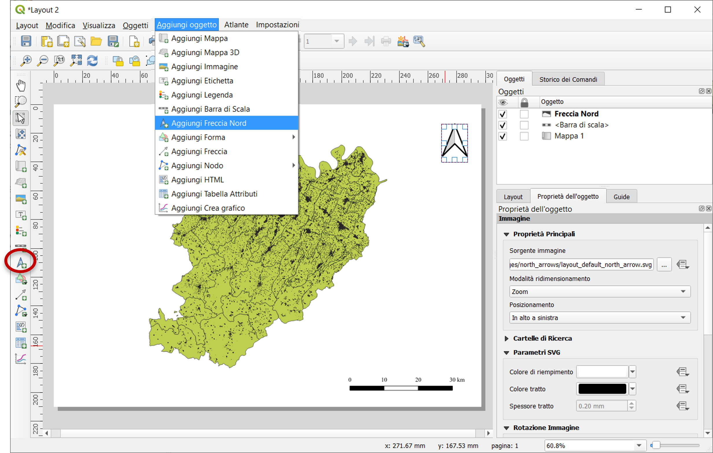
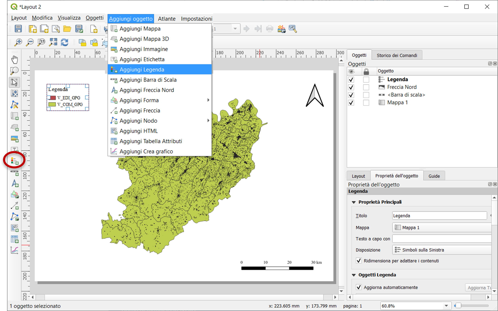
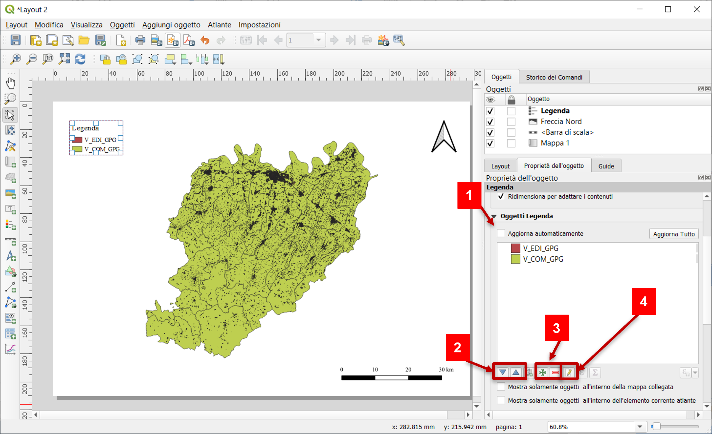
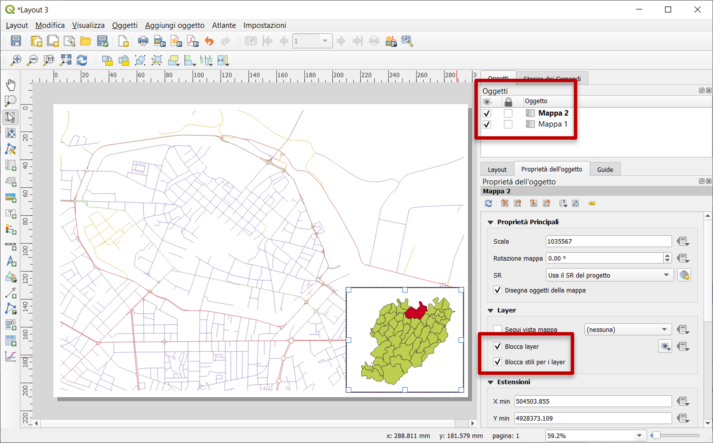
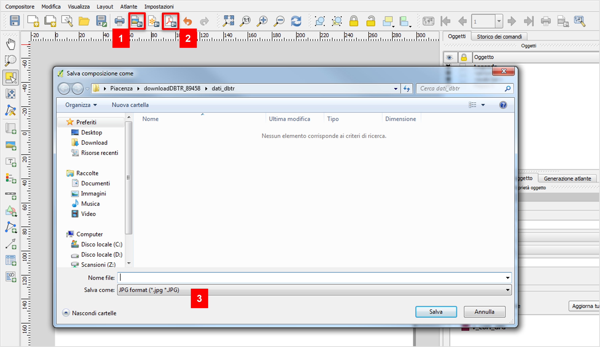

# Creazione di layout di stampa

Una volta realizzata la mappa di interesse, è necessario creare un **layout di stampa**.

Per la stampa di cartografia sono necessari alcuni elementi fondamentali:

* **barra di scala**
* **freccia del nord**
* **legenda** per tutti i layer che la richiedano

Sono altresì consigliati:

* cartiglio
* reticolo cartografico

QGIS usa uno strumento detto **compositore di stampe** attraverso cui è possibile impostare tutti gli elementi fondamentali per la stampa di cartografia.

***Progetto -> Nuovo layout di stampa -> Assegnare un titolo -> OK***

*Attenzione!* Se abbiamo più layer in uso e vogliamo creare il layout di solo uno di questi, lasciare attiva la visibilità nel pannello layers solo dello strato di interesse.

L'**estensione** e le **unità di misura** (per scala e eventuale reticolo) sono quelle del progetto QGIS da cui si parte, per cui è bene impostare correttamente il **S.R.** in funzione delle informazioni che si vogliono visualizzare sulla stampa.

Per cambiare orientazione della pagina del compositore, cliccare il tasto destro al centro dell'oggetto -> ***Proprietà pagina -> Orientazione***

## Inserire la mappa

Scegliere una delle opzioni per aggiungere la mappa alla pagina selezionando l'area a essa destinata all'interno del layout. La mappa potrà quindi essere spostata all'interno del riquadro con il comando (simbolo).

La scala di visualizzazione della mappa viene definita nella finestra *Proprietà dell'oggetto* a destra del compositore di layout. 

## Inserire la barra di scala

Una volta premuto ***Aggiungi barra di scala***, disegnare sulla mappa un'area rettangolare per poter inserire la scala.

## Inserire la freccia del Nord

Una volta premuto ***Aggiungi Freccia Nord***, disegnare sulla mappa un'area rettangolare per poter inserire la freccia.

## Inserire la legenda

Una volta premuto ***Aggiungi Legenda***, disegnare sulla mappa un'area rettangolare per poter inserire la legenda.

Per modificare la legenda:

1. Togliere il flag per poter apportare delle modifiche manualmente.
2. Per modificare la posizione del layer.
3. Per aggiungere e togliere dei campi.
4. Per modificare il nome del layer che compare in legenda.

## Stampa con finestre multiple

Per stampare due mappe distinte cambiando i layer accesi e il loro stile, è possibile impostare le opportune funzioni per il blocco dei layer attivi.

In questo caso inserire la seconda mappa con il comando *Aggiungi mappa* creando una finestra più piccola.

Nelle proprietà della nuova mappa, mettere il flag su *Blocca layer* e *Blocca stile per i layer* per fare in modo che le modifiche apportate all'altra mappa non influenzino quella selezionata.

## Salvare il layout

Nella toolbar, cliccando sulle icone evidenziate, è possibile salvare il layout composto come immagine (1) o PDF (2).

Nella finestra di salvataggio, selezionare il formato di file desiderato (3).

