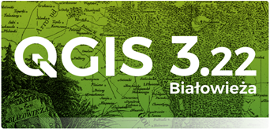
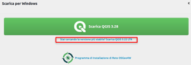
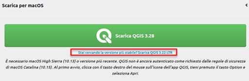
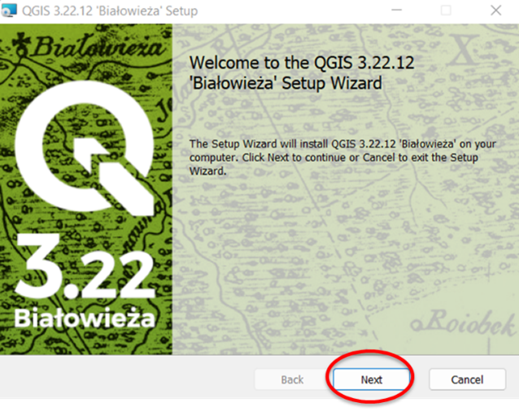
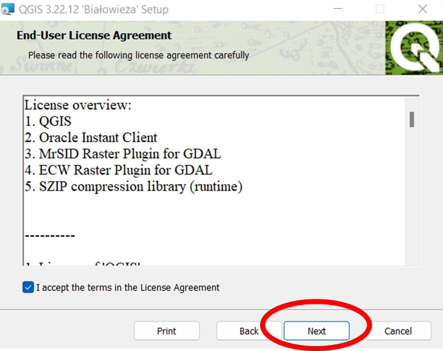
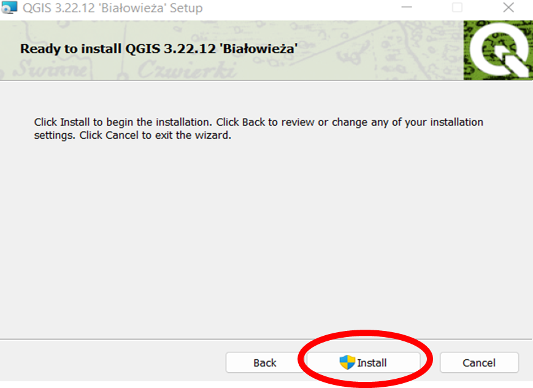
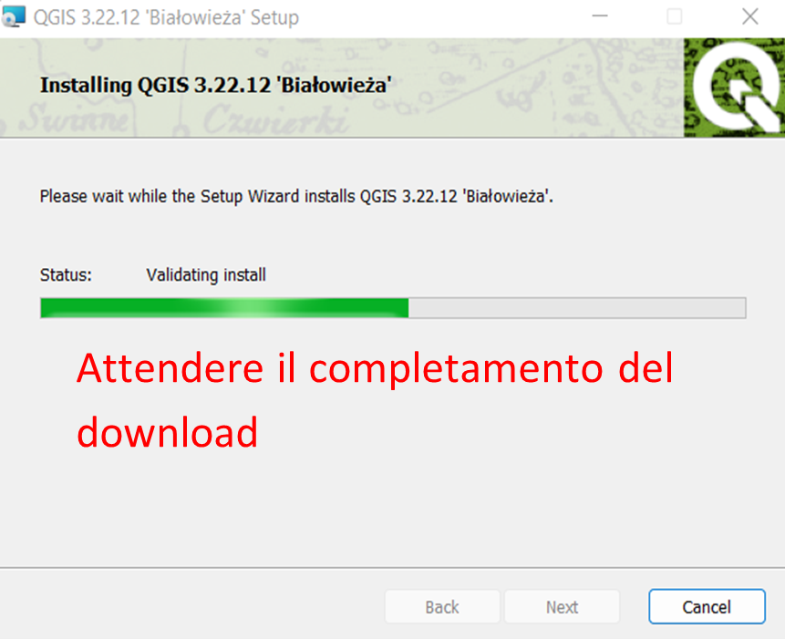
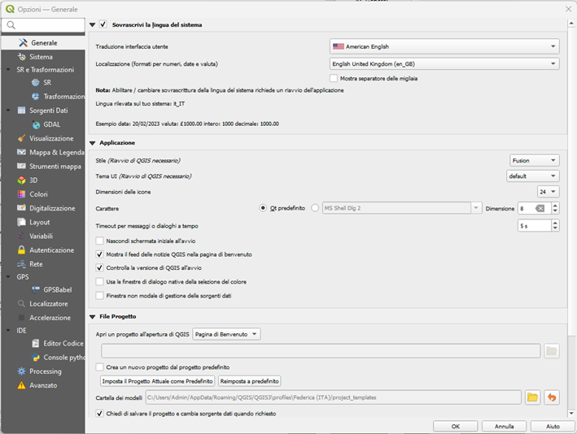
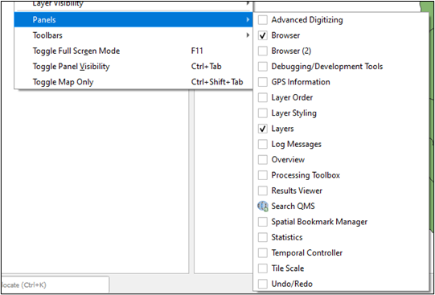
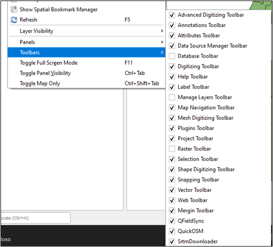

# QGIS 00

## Introduzione a QGIS

**QGIS** (un tempo noto come Quantum GIS) è un Sistema di Informazione Geografica ***Libero e Open Source***. Il progetto è nato nel maggio del 2002.

QGIS è un software GIS disponibile per chiunque possieda un pc con piattaforme di uso comune come macOS, Linux, UNIX, Microsft Windows e, sperimentalmente, Android.

QGIS è rilasciato sotto la ***GNU General Public License (GPL)*** che rende possibile modificare il codice sorgente sviluppato nel ***linguaggio C++*** e garantisce l’accesso a un programma GIS ***libero e privo di costi*** che si può liberamente modificare, seguendo indicazioni precise.

È molto simile nell’interfaccia utente e nelle funzioni ai pacchetti GIS commerciali equivalenti. QGIS è mantenuto da un ***gruppo di sviluppatori volontari*** di una community che pubblicano una nuova versione ogni quattro mesi circa.

**Formato dati supportati**

- ***Dati Vettoriali***: QGIS supporta pienamente il formato shapefile di ArcGIS, che pur essendo un formato proprietario rappresenta lo standard de facto per i dati vettoriali;
- ***Dati raster***, QGIS supporta molti tipi di formati (ArcInfo Binary Grid, ArcInfo ASCII Grid, GeoTIFF, ecc.), alcuni solo in lettura, altri in lettura e scrittura;
- Dati di tipo ***database***

QGIS è composto da:

- **QGIS Desktop** (applicazioni desktop installate sul computer di lavoro senza collegarsi al web)
- **QGIS Browser** (applicazioni utilizzate per visualizzare e accedere ai siti Web e ai loro contenuti)

## Installazione

La versione da utilizzare per le esercitazioni del corso è l’attuale Long Term Release (LTR, versione più stabile) 3.22 da scaricare nella pagina Downloads del sito del progetto: [https://www.qgis.org/it/site/forusers/download.html](https://www.qgis.org/it/site/forusers/download.html)

Nella pagina di download del sito ufficiale, selezionare la versione a lungo supporto (LTR) di QGIS 3.22 dedicata al proprio sistema operativo (Windows, macOS, Linux o Android)

*Windows*

*macOS*

Salvare ed eseguire il file d’installazione. Seguire i seguenti passaggi per l’installazione standard di QGIS:

Terminata la procedura, avviare QGIS Desktop 3.22. La corretta installazione del software è verificata con la visualizzazione dell’interfaccia grafica.

## QGIS Desktop

- Analogo ad ArcGIS Pro di ArcGIS
- Permette di interrogare i dati geografici, editarli ed effettuare analisi spaziali

L’interfaccia di QGIS Desktop contiene:

1.	**Barra dei menù**: fornisce accesso alle varie funzioni di QGIS utilizzando menù a tendina
2.	**Barra degli strumenti**: fornisce gli strumenti necessari per interagire con la mappa
3.	**Layer**: regola la visibilità e la disposizione degli strati cartografici: quelli più in alto sono sovrapposti a quelli più in basso
4.	**Area di visualizzazione**: rappresenta la cartografia relativa ai livelli vettoriali e raster selezionati nel gruppo «Layer»
5.	**Barra di stato**: mostra le coordinate relative alla posizione del mouse, la scala di visualizzazione e il sistema di riferimento utilizzato

## QGIS Browser

QGIS Browser è disponibile come applicazione standalone e come pannello in QGIS Desktop. Consente di navigare facilmente nel file system e gestire dati geografici.

- Analogo ad ArcCatalog di ArcGIS, ma con funzionalità semplificate
- Permette di creare, gestire e visualizzare in preview i file relativi a dati geografici

## Personalizzazione dell'interfaccia grafica

### Lingua del software

Di default al primo accesso al software, QGIS Desktop definirà come sua lingua di visualizzazione quella impostata dal sistema operativo di utilizzo. Per facilitare le indicazioni delle esercitazioni e il supporto a eventuali problemi con il software, per le esercitazioni *è richiesto l’utilizzo di QGIS in inglese*. In questo modo, per qualsiasi esigenza, sarà molto più semplice consultare l’ampia documentazione online in inglese a supporto degli utenti.

Nel caso in cui la lingua di sistema non sia già l’inglese, è necessario accedere alle impostazioni del software da ***Impostazioni -> Opzioni -> Tab Generale***. Nella nuova finestra, spuntare il box ***Sovrascrivi la lingua del sistema***.

Alla voce ***Traduzione interfaccia utente***, dal menù a tendina selezionare *American English*.

Alla voce ***Localizzazione (formati per numeri, date e valuta)***, dal menù a tendina selezionare *English United Kingdom (en_GB)*.

N.B.: Queste impostazioni sono particolarmente importanti per la gestione dei valori numerici che in ambiente QGIS verranno quindi gestiti considerando il punto come separatore decimale.

Per finalizzare tutte le modifiche definite nella tabella *Opzioni > Generale* è richiesto il riavvio del software.

### Visibilità dei pannelli nella GUI

Nel corso delle esercitazioni e di eventuali progetti futuri in ambienti QGIS, potrebbe essere necessaria l’attivazione di nuovi pannelli e finestre nella GUI oltre a quelli già attivi di default descritti in precedenza.

Per poter controllare in base alle proprie necessità la visibilità dei vari pannelli, è necessario accedere al menù ***View*** nella Barra dei menù. Da qui e possibile attivare o disattivare i pannelli e/o le toolbar.

## Esercizi

...

## Risorse utili

- *QGIS User Guide*: documentazione ufficiale delle funzionalità di QGIS Desktop. Link: https://docs.qgis.org/3.22/en/docs/user_manual/index.html (Ultimo accesso: 20/02/2023)

- *QGIS source code*: repository ufficiale del codice di QGIS contenente numerosi link a risorse utili (tutorial, guide etc.). Link: https://github.com/qgis/QGIS (Ultimo accesso: 20/02/2023)

- *QGIS Tutorials and Tips di Ujaval Gandhi*: sito che documenta una selezione variegata di esercizi guidati su possibili applicazioni di QGIS. Link: http://www.qgistutorials.com/it/ (Ultimo accesso: 20/02/2023)

- *Canale YouTube QGIS*: canale con raccolte di video tutorial, workshop e presentazioni legate a versioni di QGIS e sue funzionalità in progetti di vari ambiti. Link: https://www.youtube.com/@qgishome/videos (Ultimo accesso: 20/02/2023)

## Bibliografia e Dati

...

