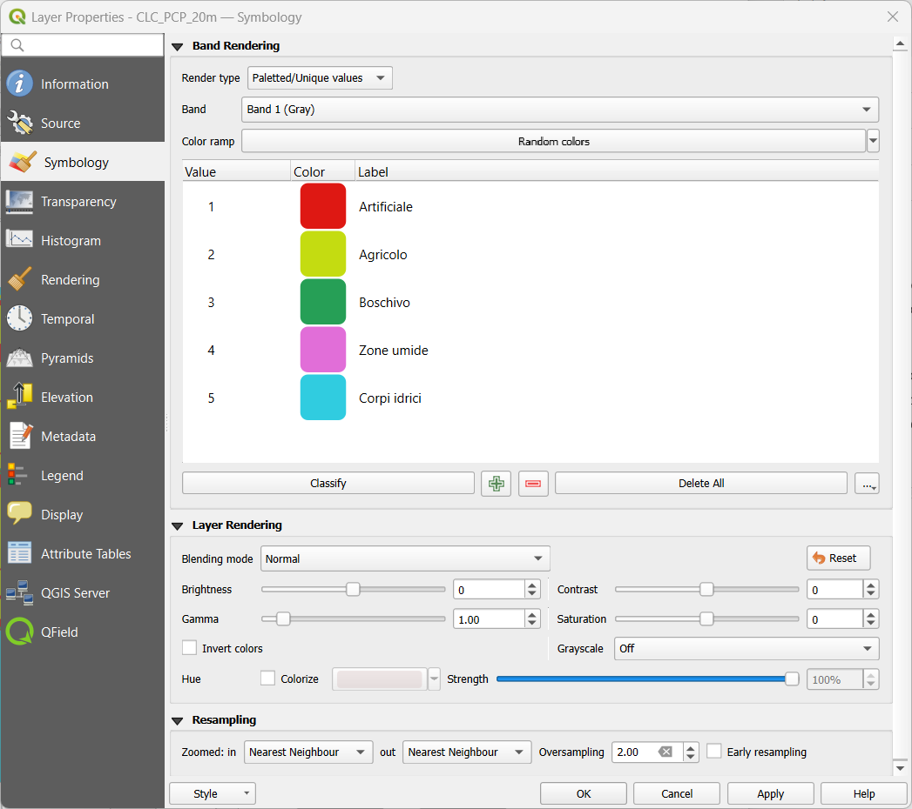

---
tags:
  - QGIS
  - Urbanistica
  - Intro
  - Vettoriali
  - Progetto
---
# Gestione progetto e interfaccia, formato dati, operazioni base

## Scopo dell’esercizio 

Visualizzare i dati relativi alla copertura del suolo per la provincia di Piacenza, isolando quelli relativi al solo comune di Piacenza.

In questo esercizio imparerai le basi della gestione di un progetto in QGIS e le modalità di caricamento di layer vettoriali. Inoltre, potrai comprendere come funzionano i sistemi di riferimento *nella pratica* e come eseguire semplici operazioni di ritaglio (*clip*).

## Dati

Shapefile:
* V_COM_GPG (limiti amministrativi dei comuni della provincia di Piacenza)
* V_EDI_GPG (edificato dei comuni della provincia di Piacenza)
Raster:
* CLC_PCP_20M.tif (classificazione della copertura del suolo nella provincia di Piacenza)

Fonte: [Geoportale Emilia Romagna](https://geoportale.regione.emilia-romagna.it/)

## Preparazione progetto

Definire le unità di misura e il percorso relativo: *Project > Properties > General Tab > Save paths > Relative*.

## Caricamento vettoriali

Caricare i layer shapefile: *Layer > Data source manager > Vector > Source*, cliccare sul pulsante con i tre pallini per selezionare il file di interesse da caricare nel progetto. In alternativa, è possibile caricare shapefile semplicemente con un’operazione di Drag&Drop (Trascina&Rilascia) con il tasto sinistro del mouse. Se l’operazione di caricamento è andata a buon fine, nella sezione Layers ora sono visibili i due strati informativi di Piacenza: V_COM_GPG e V_EDI_GPG.

Per entrambi i layer, controllare le informazioni sul loro contenuto: tasto destro > *Properties > Information*. In questa sezione è possibile controllare le caratteristiche del layer appena caricato come la sua geometria, estensione, dimensioni, sistema di riferimento e attributi. Entrambi i layer sono inquadrati nell’EPSG:25832, ovvero nel sistema di coordinate geografiche ETRS89 con proiezione cartografica UTM Zone 32Nord. Tale sistema è quello scelto dalla regione Emilia Romagna per il rilascio dei dati geografici.

Per essere coerenti con i dati in studio, anche il progetto deve essere definito nello stesso sistema di riferimento. Dal menù *Project > Properties > CRS* e nel box di ricerca cercare con il codice 25832 il sistema di interesse, selezionarlo e confermare la scelta cliccando *Apply* e poi *Ok*.

Aprire la **Tabella Attributi** per vedere i dati associati ai poligoni dei comuni: tasto destro sul layer *> Open Attribute Table*.

Selezionare il comune di Piacenza. Cliccare il tasto destro sul layer *> Export > Save selected features as*, procedere nel salvataggio selezionando il formato (ESRI Shapefile) e definendo la cartella di salvataggio e il nome del file (Piacenza_COM). Questo nuovo layer sarà utilizzato per ritagliare il layer degli edifici e quello della copertura del suolo.

## Ritaglio

Effettuare l’operazione di ritaglio sul layer V_EDI_GPG con la maschera Piacenza_COM cliccando sul menù *Vector > Geoprocessing Tools > Clip*. 

Se nella sezione *Log* compare un errore relativo a una geometria invalida, è necessario procedere alla correzione delle geometrie del layer dell’edificato con un plugin dedicato. Nel menù *Processing > Toolbox* ricercare il tool **Fix geometries** nel gruppo *Vector Geometries* ed eseguire tale operazione sul layer dell’edificato.

Una volta terminata questa operazione, ripetere quella di **Clip** sul layer corretto.

## Simbologia

Caricare il layer raster: *Layer > Data source manager > Raster > Source*, cliccare sul pulsante con i tre pallini per selezionare il file di interesse da caricare nel progetto. In alternativa, è possibile caricare shapefile semplicemente con un’operazione di Drag&Drop (Trascina&Rilascia) con il tasto sinistro del mouse. Se l’operazione di caricamento è andata a buon fine, nella sezione Layers ora è visibile lo strato informativo CLC_PCP_20cm.

Il layer appena caricato contiene le informazioni relative alla copertura del suolo in formato raster. I suoi pixel possono assumere valori interi tra 1 e 5 il cui significato corrisponde alla seguente tabella:

| Valore pixel   | Significato    | Colore standard       |
| ------ | ----- | ------- |
| 1 | Territori artificiali | Rosso |
| 2 | Terreni agricoli | Giallo |
| 3 | Aree boschive | Verde |
| 4 | Zone umide | Viola |
| 5 | Corpi idrici permanenti | Azzurro |

Dopo aver valutato le proprietà del layer, da *Properties > Simbology*, selezionare la modalità di rendering *Paletted/Unique values* e cliccare *Classify*. Questa modalità permette di definire un colore specifico per ciascun valore univoco nei pixel del raster. E' ottimale per rappresentazioni cartografiche che riguardano la mappatura del territorio secondo classi predefinite.

Dopo aver scelto la modalità di rappresentazione, fare doppio clic sui valori nella colonna Label per modificare l’etichetta della legenda colori in accordo con il significato indicato nella tabella precedente. Premere *Apply* per applicare le modifiche.

Per ritagliare le informazioni di copertura del suolo solo nel territorio del comune di Piacenza, cliccare sul menù *Raster > Extraction > Clip raster by mask layer*. Selezionare come layer in input il raster della copertura del suolo e come mask layer Piacenza_COM.

Applicare al nuovo raster ritagliato la stessa simbologia del precedente: tasto destro sul vecchio raster *> Styles > Copy Style > All Style Categories*. Sul layer raster ritagliato cliccare tasto destro, *Styles > Paste Style > All Style Categories*.

Confrontare qualitativamente la mappatura raster del Corine Land Cover con la mappatura dell'edificato per il comune di Piacenza: come si differenziano? Si notano pattern significativi?

Salvare il progetto.

## Per approfondire

[...]